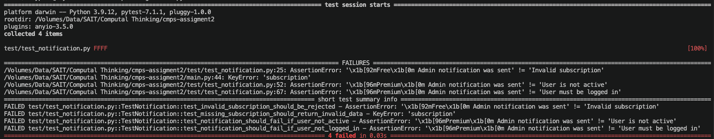
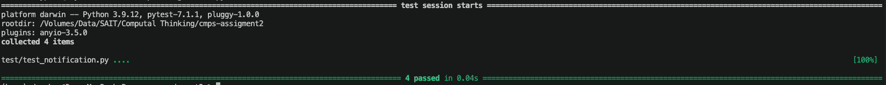

# 📘 Smart Notification System – Testing & Debugging

## 1. Overview
This project demonstrates how we tested and debugged the **Smart Notification System**.

We focused on fixing two main problems:
- Invalid subscription types (`"free1"`)
- Notifications sent to inactive or logged-out users

We used automated testing to ensure the system is stable and does not crash.

---

## 2. Testing Approach

We used Python testing frameworks to validate the system.

### A. Unit Tests
Unit tests check the `generate_notification()` function.

**What we tested:**
- Invalid subscription → return `"Invalid subscription"`
- Inactive or logged-out users → stop notification
- Missing data → return `"Invalid notification data"`

---

## 3 How to Run Tests

Run below commoent on terminal

```bash
python -m unittest discover -s test
```

or 
``` bash
pytest --tb=line
```

### Test Failure

  
*Figure 1. The system correctly handles valid and invalid subscription types.*

---

### Test Success

  
*Figure 2. Notifications are not sent to inactive or logged-out users.*

## 4 Bug Fix Explanation  
---

Modify code on main.py

## Before Fix

```python
# create notification message
def generate_notification(user_dict):

    # get role and subscription
    role = user_dict["role"].capitalize()
    subscription = user_dict["subscription"]

    if subscription == "premium":
        tier = color_text("Premium", BLUE)
    else:
        tier = color_text("Free", GREEN)

```
## After Fix

```python
def generate_notification(user_dict):

    # get role and subscription
    role = user_dict.get("role")
    subscription = user_dict.get("subscription")

    # check missing data
    if role is None or subscription is None:
        return "Invalid notification data"

    # check if user is active
    if not user_dict.get("active"):
        return "User is not active"

    # check if user is logged in
    if not user_dict.get("logged_in"):
        return "User must be logged in"

    # check subscription is valid
    if subscription not in ["free", "premium"]:
        return "Invalid subscription"

    # format role name
    role = str(role).capitalize()

    # choose message based on subscription
    if subscription == "premium":
        tier = color_text("Premium", BLUE)
    else:
        tier = color_text("Free", GREEN)

    # return final message
    return tier + " " + role + " notification was sent"
